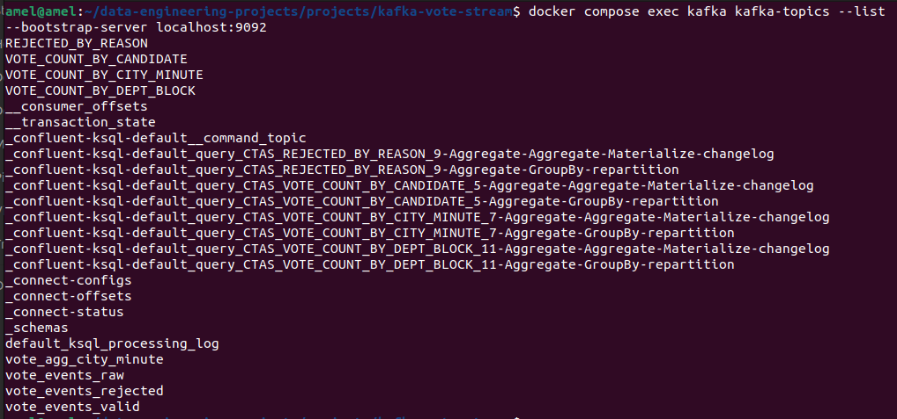
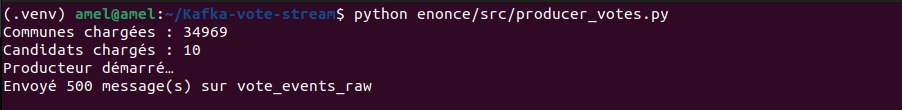
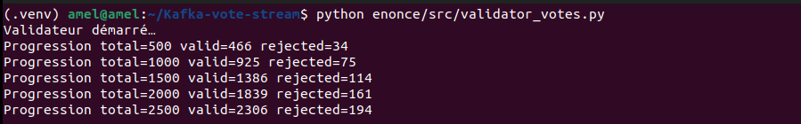
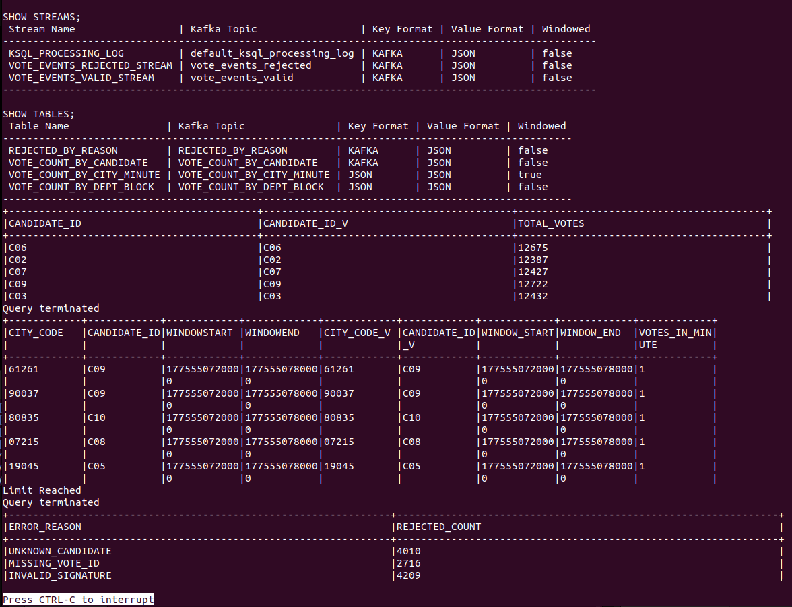
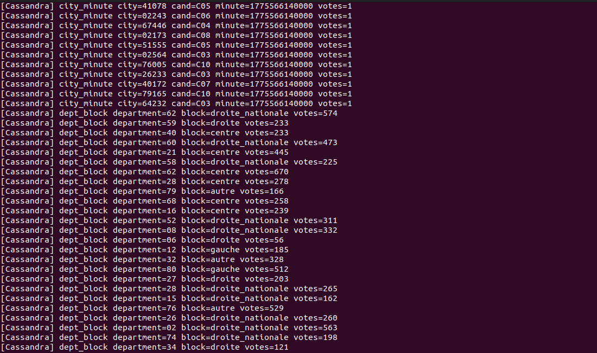
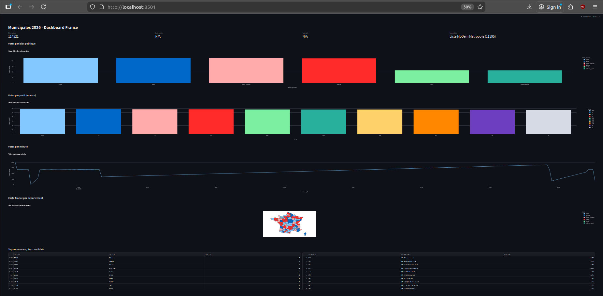

# 🚀 Kafka Vote Stream – Pipeline Temps Réel

## 📌 Objectif du projet

Ce projet consiste à construire une architecture de traitement de données en temps réel simulant un système de votes municipaux.

L'objectif est de comprendre et implémenter un pipeline complet :

* ingestion de données
* validation métier
* traitement streaming
* stockage
* visualisation

---

## 🧠 Architecture globale

```
Producer → Kafka → Validator → Kafka → ksqlDB → Cassandra → Streamlit
```

### 🔷 Schéma global

```
        ┌──────────────┐
        │  Producer    │
        └──────┬───────┘
               │ vote_events_raw
               ▼
        ┌──────────────┐
        │    Kafka     │
        └──────┬───────┘
               ▼
        ┌──────────────┐
        │  Validator   │
        └──────┬───────┘
        ┌──────┴──────────────┐
        ▼                     ▼
Valid votes           Rejected votes
        │                     │
        └──────► ksqlDB ◄─────┘
                    │
                    ▼
               Cassandra
                    │
                    ▼
               Streamlit
```

---

## ⚙️ Mise en place

### 1. Lancer la stack Docker

```bash
docker compose up -d
```

### 📸 Résultat


---

### 2. Création des topics Kafka

* vote_events_raw
* vote_events_valid
* vote_events_rejected

```bash
docker compose exec kafka kafka-topics --list --bootstrap-server localhost:9092
```

### 📸 Résultat



---

## 🚀 Producer

Le producer génère des votes simulés et les envoie dans Kafka.

```bash
python enonce/src/producer_votes.py
```

### 📸 Résultat



---

## 🛡️ Validator

Le validator filtre les votes selon des règles métier :

* signature valide
* vote_id présent
* candidat valide

```bash
python enonce/src/validator_votes.py
```

### 📸 Résultat



---

## 🧠 Traitement avec ksqlDB

Agrégation des données en temps réel :

* votes par candidat
* votes par minute
* votes par département

```sql
SELECT * FROM vote_count_by_city_minute EMIT CHANGES;
```

### 📸 Résultat



---

## 🗄️ Cassandra

Stockage des données agrégées.

```sql
SELECT * FROM votes_by_city_minute LIMIT 10;
```

### 📸 Résultat



---

## 🔄 Loader Cassandra

Transfert des données depuis Kafka vers Cassandra.

```bash
python enonce/src/load_to_cassandra.py
```

### 📸 Résultat


---

## 📊 Dashboard Streamlit

Visualisation des données :

* KPI
* Graphiques
* Carte France

```bash
streamlit run enonce/src/dashboard_streamlit.py
```

### 📸 Résultat



---

## 🗺️ Schéma final du pipeline

```
[Producer]
     ↓
[Kafka RAW]
     ↓
[Validator]
  ↓        ↓
Valid    Rejected
  ↓        ↓
     [ksqlDB]
         ↓
     [Kafka agg]
         ↓
   [Cassandra]
         ↓
   [Streamlit]
```

---

## 🎯 Conclusion

Ce projet met en œuvre une architecture complète de traitement de données temps réel.

Technologies utilisées :

* Kafka (streaming)
* Python (logique métier)
* ksqlDB (SQL streaming)
* Cassandra (NoSQL)
* Streamlit (visualisation)

---

## 📁 Structure du projet

```
kafka-vote-stream/
├── enonce/
│   ├── src/
│   ├── sql/
│   └── cql/
├── data/
├── docker-compose.yml
└── README.md
```

---

## 👨‍💻 Auteur

Amel

